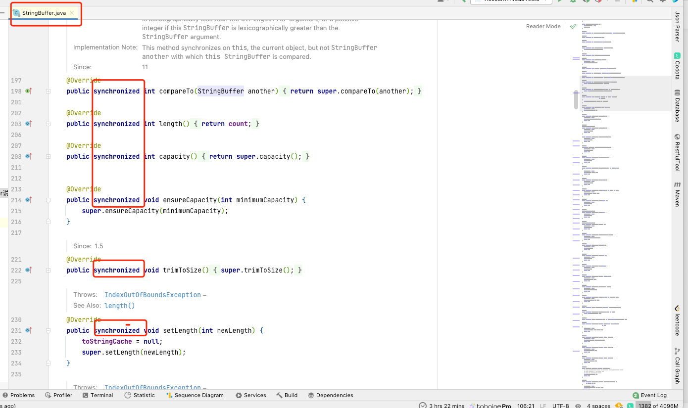
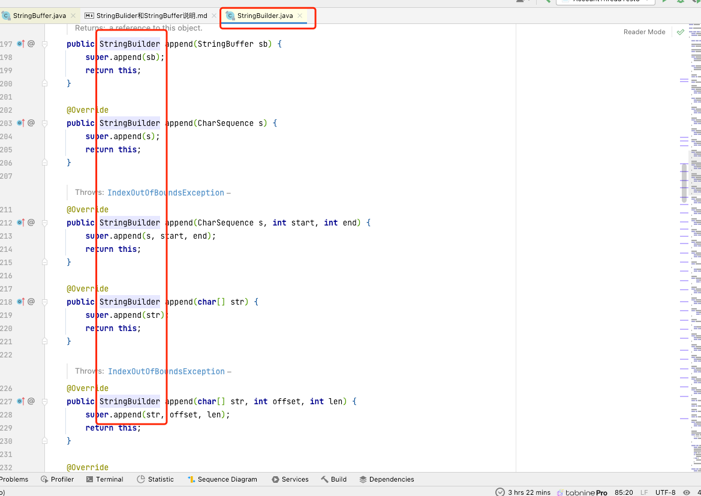

源码可知：

StringBuffer是线程安全的

StringBuilder是线程不安全的

以下的类由自己个人去看源码！ mac-idea 快捷键 command+o（这个是字母o）

Vector类和Hashtable类是线程安全的类，但ArrayList类和HashMap类不是线程安全的类。
Collections.synchronizedList() 和 Collections.synchronizedMap()等方法实现安全。
